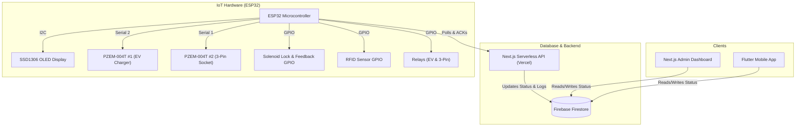
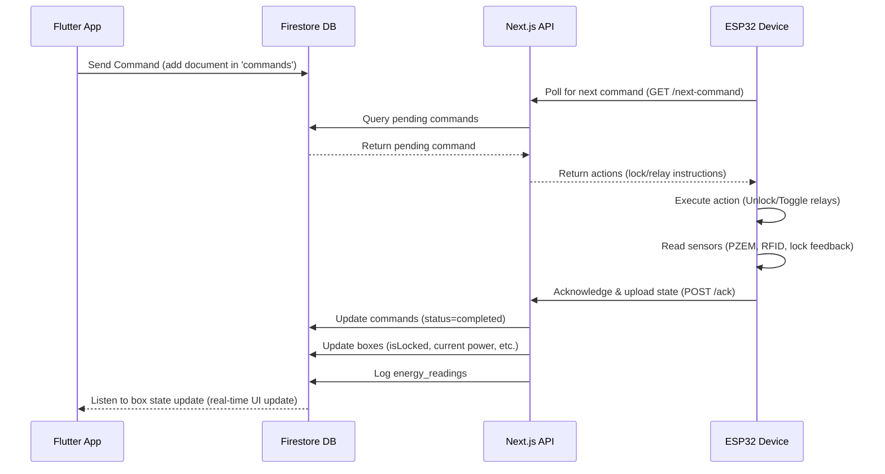

# 🔐 Smart Box: System Architecture & Functional Overview

This document provides a comprehensive, high-level analysis of the **Smart Box** ecosystem, an end-to-end IoT platform for prepaid energy-metered vehicle and appliance charging. The system comprises an ESP32 hardware controller, a Next.js admin dashboard, and a Flutter mobile application, all integrated seamlessly using a real-time Firebase Firestore database.

---

## 📌 System Topology



---

## 🚀 Architectural Component Analysis

The system is built on a distributed IoT-Cloud-Client pattern, dividing responsibilities among three core platforms:

### 1. IoT Hardware & Firmware (ESP32)
* **Microcontroller:** ESP32 running C++ code built via PlatformIO.
* **Network & Security:** Secures connection via local WiFi using custom-configured DNS servers (`8.8.8.8`, `1.1.1.1`) and HTTPS (Vercel API calls configured with TLS verification disabled `setInsecure()` for development).
* **Display Interface:** An Adafruit 128x64 SSD1306 I2C OLED display (running on SDA GPIO 21, SCL GPIO 22). The firmware automatically rotates through 4 informational screens every 5 seconds:
  1. **Main Status Screen:** Displays Device ID, WiFi network status, lock state (LOCKED/UNLOCKED), RFID presence (DETECTED/NONE), and current relay states.
  2. **Energy Readings Screen:** Displays detailed live parameters (Voltage, Current, Power, Energy) for both EV charger and 3-pin outlets.
  3. **Network Status Screen:** Displays network credentials, device health, and the last executed command ID.
  4. **Diagnostics Screen:** Displays device uptime and last known backend communication error codes.
* **Control Outputs:**
  * **Solenoid Lock Control:** Triggered via GPIO 5 (`LOCK_CONTROL_PIN`).
  * **EV Charger Relay:** Controlled via GPIO 19 (`EV_RELAY_PIN`).
  * **3-Pin Socket Relay:** Controlled via GPIO 23 (`P3_RELAY_PIN`).
* **Sensor Inputs:**
  * **Lock Status Feedback:** Read from GPIO 18 (`LOCK_FEEDBACK_PIN`).
  * **RFID Card Status Detector:** Read from GPIO 32 (`RFID_STATUS_PIN`).
  * **Energy Meters (PZEM-004T v3.0):** Two independent modules communicating via serial lines:
    * **EV Charger PZEM:** Configured on Hardware Serial `Serial2` (RX GPIO 16, TX GPIO 17, address `0xF8`).
    * **3-Pin Socket PZEM:** Configured on Software/Hardware Serial `Serial1` (RX GPIO 13, TX GPIO 12, address `0xF8`).

### 2. Backend API Layer & Admin Panel (Next.js)
* **Framework:** Next.js (React/TypeScript) deployed on Vercel.
* **Endpoints for ESP32:**
  * `GET /api/esp/next-command`: Checks for pending commands targeting the specific device in Firestore, mapping them to simplified instructions:
    * Solenoid actions: `LOCK` or `UNLOCK`.
    * Relays states: `ev` (true/false), `p3` (true/false).
  * `POST /api/esp/ack`: Accepts sensor reports, lock feedback, and PZEM energy measurements from the ESP32. Updates command status to `completed` or `failed`, stores live variables in the box profile, and logs historical readings into `energy_readings` for time-series analysis.
* **Admin Web Dashboard:**
  * Monitors real-time stats including total/active users, total/active boxes, active session metrics, and daily/cumulative revenues.
  * Provides panels to manage boxes (force toggling relays, locking/unlocking), register users, and manually stop hanging sessions.

### 3. Client Application (Flutter Mobile App)
* **Platform:** Cross-platform Flutter app for users.
* **Authentication:** Firebase Auth with email verification.
* **Core Flows:**
  1. **Box Selection:** Users scan the QR code of a physical Smart Box or enter the Box ID manually (e.g. `box_001`).
  2. **Control Panel:** Real-time state synchronization with Firestore allowing users to:
     * Send command to **Unlock Box** (stored under `/commands` collection).
     * **Start Session** (sets box state to `in_use` and registers a billing session document).
     * **Toggle Relays** (EV Charger / 3-Pin Socket) individually while the session is active.
     * **Stop Session** (validates safety conditions first: the physical box door must be closed/locked and the RFID card returned inside). Triggers a cost deduction from the user's digital wallet.
  3. **Digital Wallet:** Wallet balance tracking and tariff pricing display (e.g. EV charger ₹12/kWh, 3-Pin socket ₹8/kWh).

---

## 🔄 Sequence Interaction Flow



---

## 🗄️ Database Schema (Firestore)

### 1. `users` Collection
Tracks user credentials, registration dates, and prepaid credits.
```json
{
  "id": "user_uid",
  "displayName": "John Doe",
  "email": "john@example.com",
  "isActive": true,
  "walletBalance": 500.0,
  "createdAt": "Timestamp"
}
```

### 2. `boxes` Collection
Maintains real-time status parameters of each Smart Box hardware unit.
```json
{
  "id": "box_001",
  "ownerUid": "user_uid_or_null",
  "isOnline": true,
  "isLocked": true,
  "rfidDetected": false,
  "status": "available", // "available" | "in_use" | "offline"
  "devices": {
    "evCharger": {
      "isOn": false,
      "voltage": 0.0,
      "current": 0.0,
      "power": 0.0
    },
    "threePinSocket": {
      "isOn": false,
      "voltage": 0.0,
      "current": 0.0,
      "power": 0.0
    }
  },
  "lastUpdated": "Timestamp"
}
```

### 3. `commands` Collection
Holds transient operations sent from client apps to hardware nodes.
```json
{
  "id": "command_document_id",
  "boxId": "box_001",
  "userId": "user_uid",
  "commandType": "unlock", // "unlock" | "lock" | "deviceControl"
  "payload": {
    "device": "evCharger", // only for deviceControl
    "action": "turnOn" // "turnOn" | "turnOff"
  },
  "status": "pending", // "pending" | "completed" | "failed"
  "createdAt": "Timestamp",
  "executedAt": "Timestamp",
  "espResult": {
    "success": true,
    "lockState": "UNLOCKED",
    "evOn": true,
    "p3On": false
  }
}
```

### 4. `sessions` Collection
Maintains billing history, session duration, and real-time charging telemetry.
```json
{
  "id": "session_document_id",
  "userId": "user_uid",
  "boxId": "box_001",
  "status": "completed", // "active" | "completed"
  "startTime": "Timestamp",
  "endTime": "Timestamp",
  "duration": 3600, // seconds
  "cost": 24.50, // total cost in ₹
  "devices": {
    "evCharger": {
      "energyConsumed": 1.25, // kWh
      "cost": 15.00 // ₹
    },
    "threePinSocket": {
      "energyConsumed": 1.18, // kWh
      "cost": 9.50 // ₹
    }
  }
}
```

### 5. `energy_readings` Collection
A historical log populated directly during the ESP32 acknowledgment loop, facilitating time-series graphing.
```json
{
  "boxId": "box_001",
  "source": "ev", // "ev" | "p3"
  "voltage": 231.4,
  "current": 15.8,
  "power": 3656.1,
  "energy": 12.45, // Cumulative lifetime reading (kWh)
  "recordedAt": "Timestamp"
}
```

---

## 🔒 Security Rules Overview
Firestore utilizes custom-configured security rules to protect user credentials and device status documents:
1. **User Scope Isolation:** Users can only query or update their own user documents.
2. **Ownership Enforcement:** A user is designated as the box owner (`ownerUid` matching the authenticated UID) to query or control the device.
3. **Write Isolation:** Mobile users are forbidden from writing to physical device states directly (represented in `status` or `energy_readings` fields). They are limited to placing command proposals under the `/commands` path.
4. **Backend Privilege:** Vercel backend processes bypass regular firestore-client rules using the authoritative Firebase Admin SDK.
